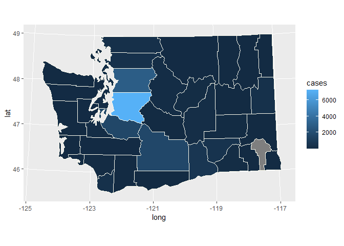
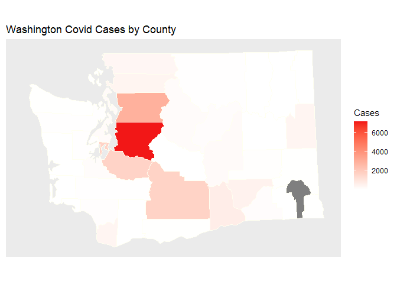
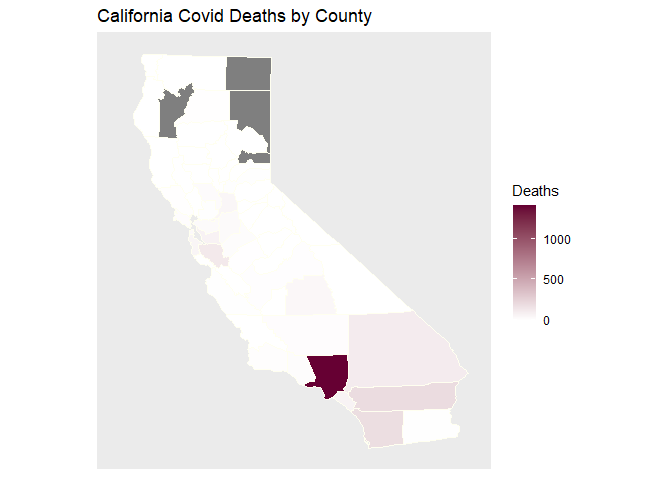

Covid 19 Maps : Sid Gurajala
================

## INTRO:

This was a little project I did over this weekend using Kaggle data and
the internet to try to find and map Covid 19 data in the US\! I had a
whole lot of free time.

## DATA:

I got my data from kaggle:
<https://www.kaggle.com/fireballbyedimyrnmom/us-counties-covid-19-dataset>.

This is a data set on kaggle sourced from the New York Times: here I’ve
taken this data and pared it down to the state I’m interested in,
Washington, and the most recent date this data was collected, May 7th
2020.

``` r
library(dplyr)
washington_df <- us_counties_covid %>% 
                  filter(state == "Washington" & date == "2020-05-07") %>% 
                  mutate(county = tolower(county)) %>% 
                  group_by(county) %>% 
                  summarize(
                    cases = cases,
                    deaths = deaths)
head(washington_df)
```

    ## # A tibble: 6 x 3
    ##   county  cases deaths
    ##   <chr>   <int>  <int>
    ## 1 adams      49      0
    ## 2 asotin     18      2
    ## 3 benton    665     51
    ## 4 chelan    142      6
    ## 5 clallam    19      0
    ## 6 clark     375     23

The next step includes taking data from the maps library, which has to
be downloaded externally, of the latitude and longitude of Washington
state counties. Then we have to join the data frame outputted by the
map\_data function with our pared down washington\_df data frame. A bit
of a warning here: the washington\_df doesn’t contain data from all
counties, but wash\_counties has coordinates for all of them. Rather
than remove the resulting NA values, I’ve decided to keep them as an
indication of that data not being included by the New York Times.

``` r
library(maps)
wash_counties <- map_data("county", "Washington") %>% 
                    rename(county = subregion)
wash_counties_deaths_cases <- left_join(wash_counties, washington_df)
```

    ## Joining, by = "county"

``` r
head(wash_counties_deaths_cases)
```

    ##        long      lat group order     region county cases deaths
    ## 1 -118.2356 46.73617     1     1 washington  adams    49      0
    ## 2 -119.3700 46.74190     1     2 washington  adams    49      0
    ## 3 -119.3700 46.74190     1     3 washington  adams    49      0
    ## 4 -119.3757 46.90232     1     4 washington  adams    49      0
    ## 5 -118.9804 46.90805     1     5 washington  adams    49      0
    ## 6 -118.9804 47.25756     1     6 washington  adams    49      0

This output is what we’ll use to create the map of cases that is the
objective of this whole thing. On to plotting\!

## MAKING A MAP:

Here we want to start out by taking our joined
wash\_counties\_deaths\_cases data frame and inputting the latitude and
longitude coordinates to make an outline of the plot we want to use. The
fill here is cases, but we could also use deaths as you’ll see in an
example towards the end of this document. You’ll need to install the
ggplot2 package separately.

``` r
library(ggplot2)
wash0 <- ggplot(data = wash_counties_deaths_cases,
             mapping = aes(x = long, y = lat, group = group, fill = cases))
```

The output of this, wash0, isn’t actually the map of washington state.
Here we’ve set the stage for ggplot2, and we have to provide directions
as to what actual map projection, in this case the albers projection, we
want ggplot2 to implement our cases, latitude, and longitude data with.
The output of the next few lines of code will give you a heatmap of
cases in Washington state. The grey areas are places in which the values
are NA and the data set provided no information on cases/deaths for
these counties.

``` r
wash1 <- wash0 + geom_polygon(color = "ivory", size = 0.3) +
  coord_map(projection = "albers", lat0 = 45.55, lat1 = 49)
wash1
```

<!-- -->

This is a cool output\! However, we have a few things left. I found this
little no\_axes trick on stack overflow; it removes things like the axis
labels and the latitude and longitude labels to produce a cleaner map\!
I’m going to pair this with our wash1 output to create a map without the
longitude and latitude labels, and then add a few labels and odds and
ends, like changing the color scheme, to make a more spiffy map\!

``` r
no_axes <- theme(
  axis.text = element_blank(),
  axis.line = element_blank(),
  axis.ticks = element_blank(),
  panel.border = element_blank(),
  panel.grid = element_blank(),
  axis.title = element_blank()
)

wash2 <- wash1 + scale_fill_gradient(low = "white", high = "#F21717") +
  labs(title = "Washington Covid Cases by County") + no_axes

wash_covid_map <- wash2 + labs(fill = "Cases")
```

Here’s our output: a map of washington covid cases by county\!
<!-- -->

## CALIFORNIA, AN INTEGRATED EXAMPLE:

Here I’m going to show a cool example I made using California, but
without any of the intermediate steps\! The code is more or less the
same, so check it out below\!

``` r
library(ggplot2)
library(maps)
library(dplyr)
california_df <- us_counties_covid %>% 
  filter(state == "California" & date == "2020-05-07") %>% 
  mutate(county = tolower(county)) %>% 
  group_by(county) %>% 
  summarize(
    cases = cases,
    deaths = deaths)

cali_counties <- map_data("county", "California") %>% 
  rename(county = subregion)

cali_counties_deaths_cases <- left_join(cali_counties, california_df)
```

    ## Joining, by = "county"

``` r
cali0 <- ggplot(data = cali_counties_deaths_cases,
             mapping = aes(x = long, y = lat, group = group, fill = deaths))

cali_covid_map <- cali0 + geom_polygon(color = "ivory", size = 0.3) +
  coord_map(projection = "albers", lat0 = 32, lat1 = 42) +
  labs(title = "California Covid Deaths by County") +
  scale_fill_gradient(low = "white", high = "#660033") +
  no_axes +
  labs(fill = "Deaths")
```

Now let’s take a look at our map\!

<!-- -->
